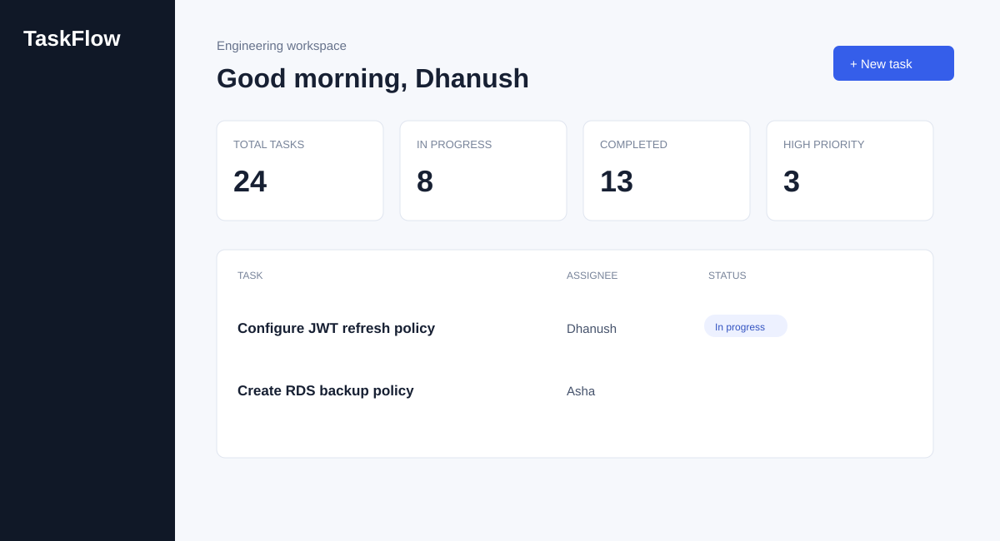
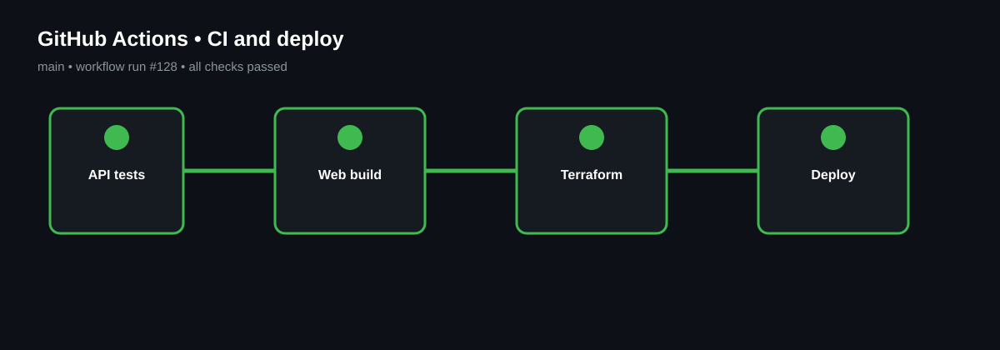

# Cloud-Native Task Management Platform

A production-style task collaboration application with secure authentication, role-aware task workflows, fast search, and an AWS deployment blueprint.



## Highlights

- JWT registration and login, plus `admin`, `manager`, and `member` roles
- Create, update, assign, filter, sort, and delete tasks
- React + TypeScript dashboard with status, priority, and owner filters
- FastAPI REST API with SQLAlchemy/PostgreSQL configuration
- Docker Compose for local development, Terraform for AWS (EC2, RDS, S3), and GitHub Actions CI
- Structured logging, consistent API errors, and automated API tests

## Architecture

```text
React + TypeScript  ->  FastAPI REST API  ->  PostgreSQL (RDS)
        |                       |                  |
        +---- S3 assets --------+---- JWT -----------+
GitHub Actions -> Docker image -> EC2 deployment (Terraform-managed)
```

## Screens

| Dashboard | CI/CD workflow |
| --- | --- |
|  |  |

## Run locally

```bash
cp .env.example .env
docker compose up --build
```

- Dashboard: `http://localhost:5173`
- API docs: `http://localhost:8000/docs`

For a non-Docker frontend preview, run `npm install && npm run dev` inside `frontend/`.

## API examples

```bash
curl -X POST http://localhost:8000/api/v1/auth/login \
  -H "Content-Type: application/json" \
  -d '{"email":"demo@example.com","password":"ChangeMe123!"}'

curl http://localhost:8000/api/v1/tasks?status=in_progress \
  -H "Authorization: Bearer <token>"
```

## Project layout

```text
frontend/       React dashboard
backend/        FastAPI API, tests, Dockerfile
infra/          Terraform AWS resources
.github/        CI workflow
docs/images/    Local UI and pipeline visualizations
```

## Deployment notes

Terraform provisions a VPC, EC2 instance, PostgreSQL RDS instance, and private S3 bucket. Before applying, set secure variable values and use a remote state backend. The included workflow validates both applications, runs tests, builds images, and has a guarded deployment job for AWS credentials stored as GitHub secrets.

## Screenshots and demonstrations

The images in this repository are local product/documentation visualizations generated from the included UI design. They show representative demo data; they are not screenshots of a real AWS account, Slack workspace, or production pipeline.
